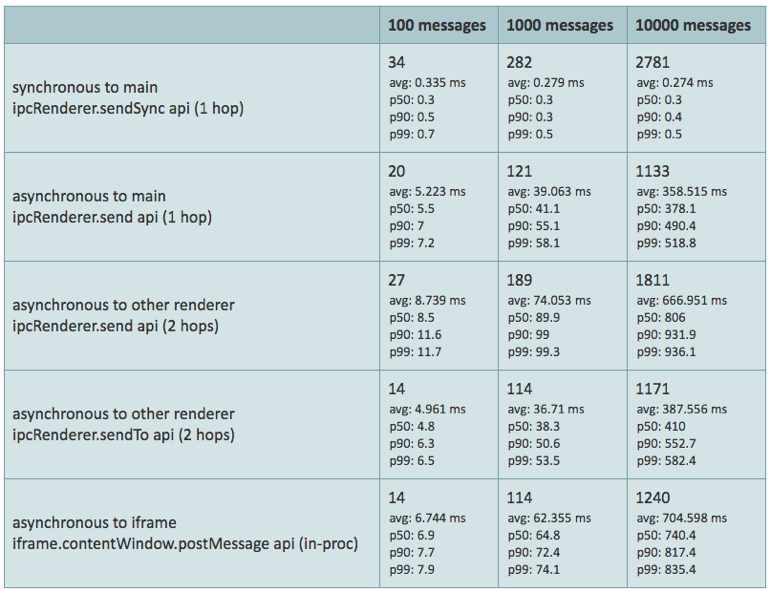
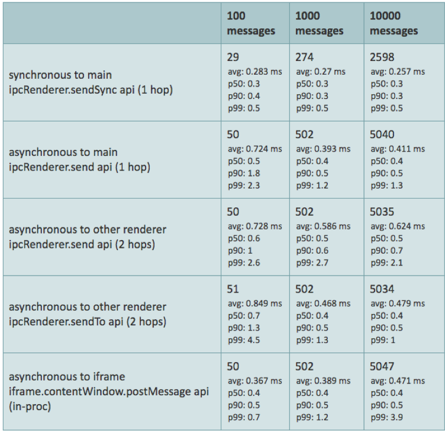
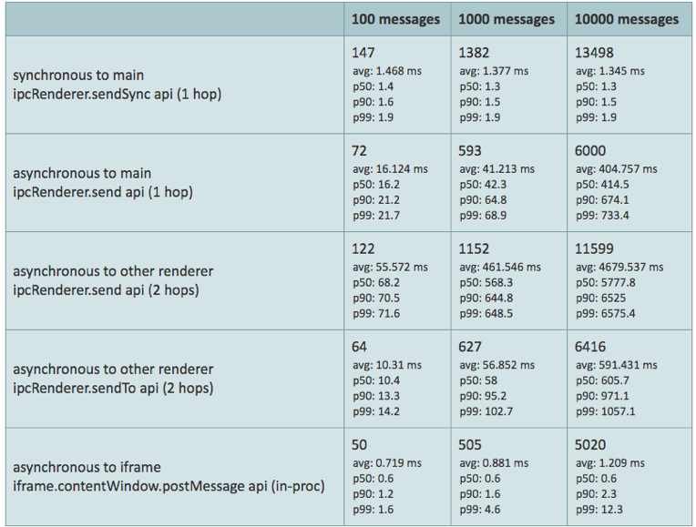
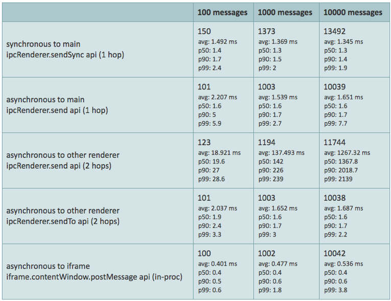

# IPC best practices

* Send smaller payload
    * Send only stuff that’s actually used, filter on sender side, not recipient
    * If some data can be calculated, do it on recipient side

* Send less messages
    * Do not que all messages immediately, if there is a bunch of them
    * Schedule messages 1ms apart, if you’re sending a lot of them (or big payload) and experiencing lagging

* Do not fill up the queue with multiple messages instantly, you’ll choke it (tens or more)

* JSON.stringifying the data before seems to have some positive impact

* When posting message across different renderers, sendTo seems to be generally faster

* Don't block the main process. Use async wherever possible. **Blocking the main process also blocks the renderer process** - more information [here](https://medium.com/actualbudget/the-horror-of-blocking-electrons-main-process-351bf11a763c) and there is also [this tweet](https://twitter.com/joaomoreno/status/1031814234122928128) from our very own João Moreno. Blocking the main process blocks the IPC and renderer, making it seem that the IPC is slow.

## Some data

For an object of small size (user profile with 8 keys, 1 inner object with 4 keys and one array of 3 phone numbers), wait time between messages set to **0ms**:

Now with time between messages set to 0.5ms

From this data its evident that even for 10 000 messages pushed to the queue with **0.5** ms in between them, the IPC is still very fast, with P90 for all scenarios being under **1 ms and P99 being always under 4 ms**, or around 1-2 for different scenarios. For **0 wait time**, we basically choke the queue, with roundtrip time always being in **hundreds of milliseconds**. However, the **total elapsed time** to send those is obviously shorter.

After changing the payload to contain 90 phone numbers (objects of type: string and number: string), the data looks like this:

Clearly, when sending bigger object, we choke the IPC and **0.5ms is not enough** anymore for the message to be parsed, send and response received.

If we change the wait time between messages to 1ms, we get these results:

Its apparent that sending messages 1ms apart improves the P values for each message significantly. However, again, the total time for the test to be finished is longer.
