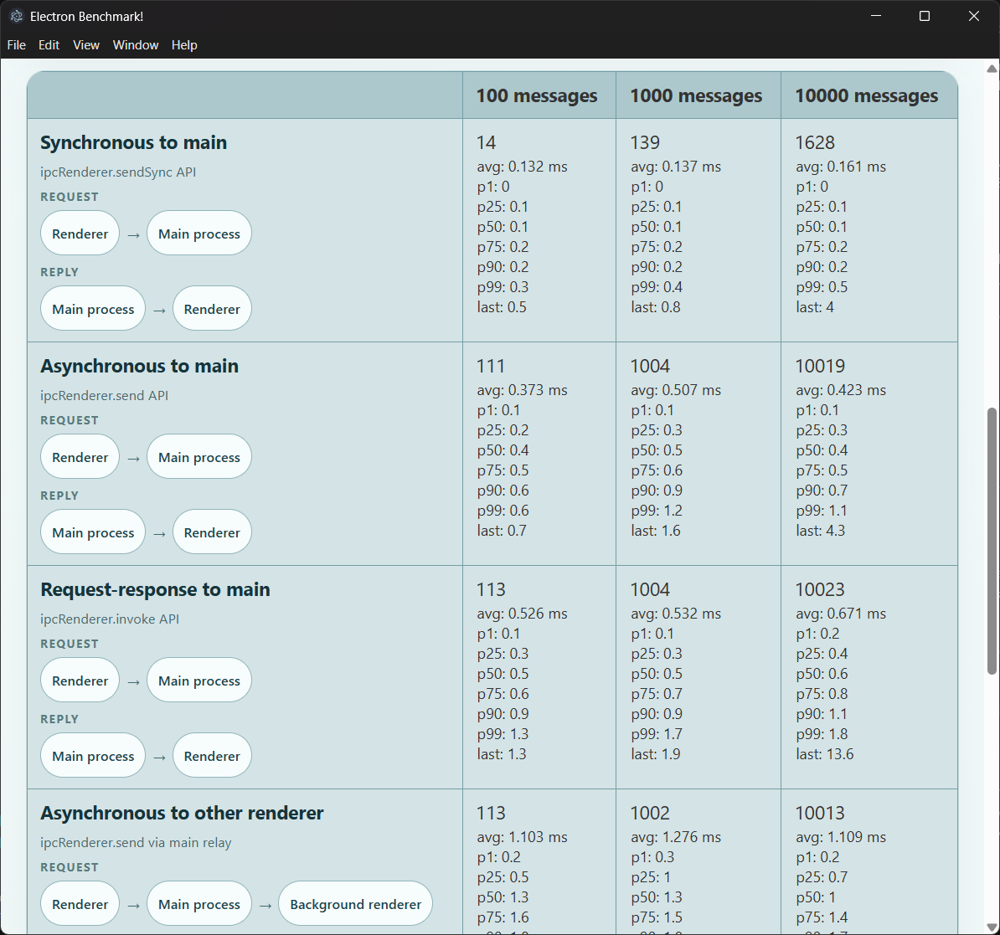

# electron-bench
This Electron app benchmarks round-trip latency across several Electron IPC routes and can also refresh its benchmark documentation from the command line.

It currently compares these routes:

* `ipcRenderer.sendSync` to the main process
* `ipcRenderer.send` to the main process
* `ipcRenderer.invoke` request-response to the main process
* renderer-to-renderer messaging relayed through the main process
* renderer-to-renderer messaging through the app's main-routed relay API
* renderer-to-renderer messaging over `MessagePort`
* `iframe.contentWindow.postMessage` within the same renderer process

## Run the app

```
git clone https://github.com/ZacWalk/electron-bench.git
cd electron-bench
npm install
npm start
```

What you should see:


## Command-line benchmark flow

The repository now supports running the same benchmark scenarios without using the UI.

### Generate fresh benchmark JSON

```
npm run bench:run
```

This launches Electron in automation mode, runs all benchmark scenarios, and writes structured output to `bench-results/latest.json`.

### Refresh the best-practices document from the latest JSON

```
npm run bench:update-docs
```

This reads `bench-results/latest.json` and rewrites the generated benchmark data section in `best-practices.md`.

### Run benchmarks and refresh docs in one step

```
npm run bench:refresh-docs
```

### Regenerate docs from a different saved result file

```
npm run bench:update-docs -- --input path/to/results.json
```

## Latest run summary

The following numbers come from the latest automated local run on March 30, 2026.

Runtime: Node.js `24.14.0`, Chromium `146.0.7680.166`, Electron `41.1.0`

Run settings: wait time `1 ms`, stringify JSON `off`, payload size `333 bytes`

| Scenario | 100 messages | 1000 messages | 10000 messages | Notes |
| --- | ---: | ---: | ---: | --- |
| Synchronous to main (`sendSync`) | 17 ms | 137 ms | 1378 ms | Lowest raw latency, but blocks the main process |
| Asynchronous to main (`send`) | 102 ms | 1003 ms | 10022 ms | Solid async baseline when you already have a reply channel |
| Request-response to main (`invoke`) | 104 ms | 1008 ms | 10019 ms | Convenient API with slightly more request-response overhead |
| Async to other renderer via main relay | 106 ms | 1002 ms | 10013 ms | Most expensive cross-renderer route in this run |
| Async to other renderer via main-routed relay API | 103 ms | 1012 ms | 10023 ms | Similar total time to the older relay, still worth measuring separately |
| Direct channel to other renderer (`MessagePort`) | 102 ms | 1008 ms | 10017 ms | Fastest non-blocking renderer-to-renderer route |
| Async to iframe (`postMessage`) | 104 ms | 1013 ms | 10017 ms | Strong in-process baseline |

If you care about per-message latency instead of total run time, the same run showed these average round-trip values for 10,000 messages:

* `sendSync` to main: `0.136 ms`
* `send` to main: `0.599 ms`
* `invoke` to main: `0.542 ms`
* other renderer via main relay: `1.267 ms`
* other renderer via main-routed relay API: `1.275 ms`
* other renderer via `MessagePort`: `0.435 ms`
* iframe via `postMessage`: `0.463 ms`

Practical summary from this run:

* `sendSync` remains fastest in raw latency, but that comes from blocking behavior
* `MessagePort` is the fastest non-blocking route tested here
* `iframe.postMessage` is very close to `MessagePort` when the traffic can stay in one renderer process
* both main-mediated renderer-to-renderer routes are materially slower than `MessagePort` and iframe messaging in this app


# IPC Best practices document

[IPC Best practices document](best-practices.md) is a short set of notes based on the benchmark results in this repository.
