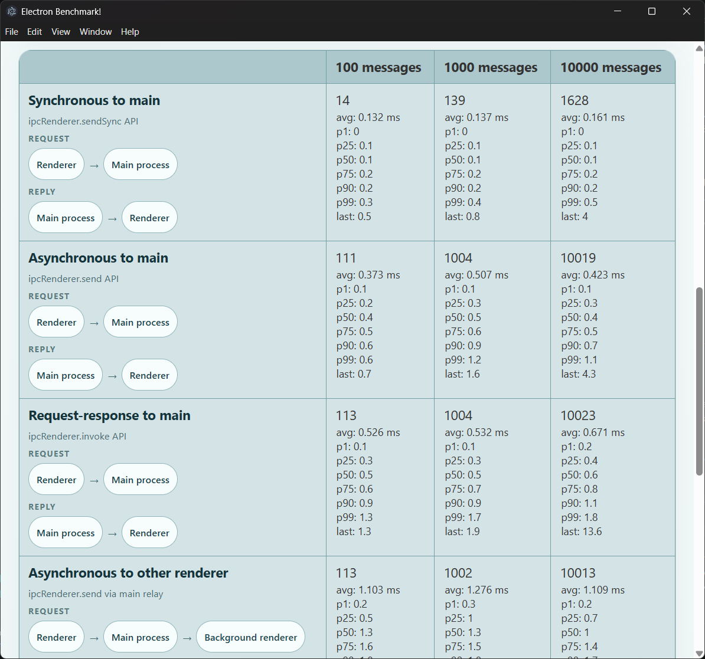

# electron-bench

[](https://github.com/ZacWalk/electron-bench/actions/workflows/ci.yml)

This Electron app benchmarks Electron's messaging routes and can also refresh its benchmark documentation from the command line.

For every scenario it reports **round-trip latency (p50/p99)** and **main-process CPU consumed**. The second number is usually the one that matters: nearly every route lands within about 1 ms per message, but they differ by more than 60x in how much work they push onto the main process.

It measures three things.

**Transport routes** — the same payload and schedule on every route:

* `ipcRenderer.sendSync` to the main process
* `ipcRenderer.send` to the main process
* `ipcRenderer.invoke` request-response to the main process
* renderer-to-renderer messaging relayed through the main process
* renderer-to-renderer messaging through the app's main-routed relay API
* renderer-to-renderer messaging over `MessagePort`
* renderer-to-`utilityProcess` messaging over `MessagePort`
* `iframe.contentWindow.postMessage` within the same renderer process

**Sandbox and contextBridge cost** — an identical `invoke` loop run two ways, so the difference is only the configuration:

* a sandboxed renderer (`sandbox: true`) calling through `contextBridge` from the page main world
* an unsandboxed preload (`sandbox: false`) calling `ipcRenderer` directly

**Payload size and shape** — transport held constant on `MessagePort`, only the payload changes: 1 KB / 64 KB / 1 MB JSON, a deeply nested object, and a 1 MB `ArrayBuffer` sent by copy versus by transfer list.

## Method notes

* Transport and bridge scenarios schedule one message every "wait time" interval, so roughly one request is in flight at a time
* Payload scenarios send strictly one message at a time and wait for each round trip. A 1 MB payload takes far longer than the send spacing, so scheduling it on a timer would measure queue depth rather than cost
* Every scenario uses the same send schedule as the others in its group, including `sendSync`, so the routes are directly comparable
* Payload construction happens before the clock starts, so it is not counted as transport cost
* Main-process CPU is sampled from the OS, which accounts CPU in ~16 ms ticks on Windows. Small values round to 0 and only become meaningful at the larger message counts

## Run the app

```
git clone https://github.com/ZacWalk/electron-bench.git
cd electron-bench
npm install
npm start
```

What you should see:


## Command-line benchmark flow

The repository now supports running the same benchmark scenarios without using the UI.

### Generate fresh benchmark JSON

```
npm run bench:run
```

This launches Electron in automation mode, runs all benchmark scenarios, and writes structured output to `bench-results/latest.json`.

### Refresh the best-practices document from the latest JSON

```
npm run bench:update-docs
```

This reads `bench-results/latest.json` and rewrites the generated benchmark data section in `best-practices.md`.

### Run benchmarks and refresh docs in one step

```
npm run bench:refresh-docs
```

### Regenerate docs from a different saved result file

```
npm run bench:update-docs -- --input path/to/results.json
```

## Continuous integration

Even though this is a GUI app, every push and pull request is validated by actually launching it. The workflow in `.github/workflows/ci.yml` runs on Linux, Windows, and macOS:

1. `npm ci` installs dependencies.
2. `npm run check` parses every file in `src/` and `scripts/`.
3. `npm run bench:smoke` launches Electron with hidden windows and a reduced message count, then exits with the run's status code. On Linux this runs under `xvfb-run`, which provides a virtual display.
4. `node scripts/validate-results.js` fails the build unless every scenario produced a complete, healthy result.

Run the same gate locally with:

```
npm test
```

## Latest run summary

The following numbers come from the latest automated local run on August 10, 2026.

Runtime: Node.js `24.18.0`, Chromium `150.0.7871.129`, Electron `43.2.0`

Run settings: wait time `1 ms`, default payload `333 bytes`

### Transport routes, 10,000 messages

| Scenario | Latency p50 | Latency p99 | Main-process CPU |
| --- | ---: | ---: | ---: |
| Synchronous to main (`sendSync`) | 0.2 ms | 0.6 ms | 1281 ms |
| Asynchronous to main (`send`) | 0.7 ms | 2.5 ms | 1062 ms |
| Request-response to main (`invoke`) | 0.4 ms | 1.6 ms | 1672 ms |
| Async to other renderer via main relay | 1.7 ms | 4.8 ms | 2015 ms |
| Async to other renderer via main-routed relay API | 1.5 ms | 3.5 ms | 1454 ms |
| Direct channel to other renderer (`MessagePort`) | 0.5 ms | 1.0 ms | 375 ms |
| Direct channel to utility process (`utilityProcess`) | 0.5 ms | 1.0 ms | 140 ms |
| Async to iframe (`postMessage`) | 0.6 ms | 1.1 ms | 62 ms |

### Payload sweep, 100 messages over `MessagePort`, sent one at a time

| Payload | Latency p50 | Latency p99 |
| --- | ---: | ---: |
| JSON, 1 KB | 0.2 ms | 0.4 ms |
| JSON, 64 KB | 1.5 ms | 5.4 ms |
| JSON, 1 MB | 21.5 ms | 24.1 ms |
| Deeply nested object | 0.4 ms | 0.6 ms |
| ArrayBuffer 1 MB, copied | 4.1 ms | 9.8 ms |
| ArrayBuffer 1 MB, transferred | 3.2 ms | 5.4 ms |

Practical summary from this run:

* Latency barely separates the transports. Main-process CPU separates them by more than 20x
* `sendSync` has the lowest latency and one of the highest main-process CPU costs. The number that makes people reach for it is not the number that matters
* `MessagePort` and `utilityProcess` channels keep main-process CPU low, because main is only involved in setup
* A sandboxed renderer going through `contextBridge` came within 0.1 ms of an unsandboxed preload calling `ipcRenderer` directly, so performance is a weak argument for disabling the sandbox
* Payload size swamps transport choice: 1 MB of JSON costs around a hundred times what 1 KB costs on the same route
* Transferring a 1 MB `ArrayBuffer` instead of copying it was about 1.3x cheaper, and the gap widens as buffers grow

These are single-run numbers from one machine. The ordering between routes is stable, but the exact multiples move between runs, particularly the CPU figures.


# IPC Best practices document

[IPC Best practices document](best-practices.md) is a short set of notes based on the benchmark results in this repository.
